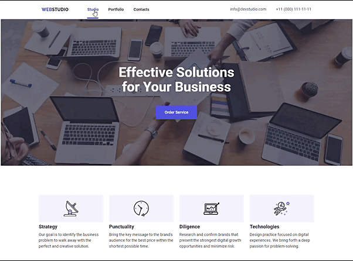

# WebStudio
Двосторінковий сайт Веб студії для презентації компанії та знайомства відвідувача з командою, реалізованими кейсами та основними клієнтами.

[Жива сторінка](https://andrijkarmaza.github.io/WebStudio/index.html)

## Реалізовано:

* Семантична верстка на всіх сторінках.
* Адаптивна/гумова верстка.
* Логотипи на іконки виконані спрайтом з svg для подальшої зміни кольорів при необхідності.
* Анімовані `hover` та `focus` на кнопках, іконках та посиланнях.
* Компонент `heder` з навігацією по сторінках та контактними даними.
* Компонент `footer` з посиланнями на соціальні мережі та формою підписки на розсилку.
* Сторінка `Studio` :
    + основні принципи компанії;
    + сфера діяльності;
    + картки команди з посиланнями на соцмережі;
    + картки з посиланнями на основних клієнтів компанії;
    + відкриття модального вікна при натисненні кнопки `Order Service` для замовлення послуги.
* Сторінка `Portfolio` :
    + кнопки для фільтрації портфоліо по категоріям;
    + картки виконаних робіт з анімацією та описом проекту при ховері.

## Використані технології:

